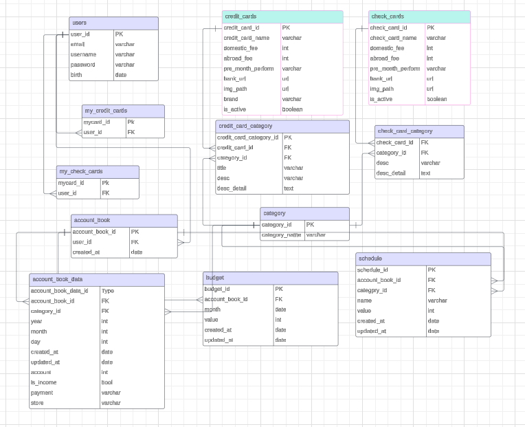
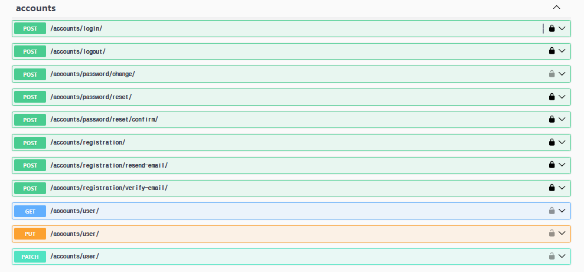
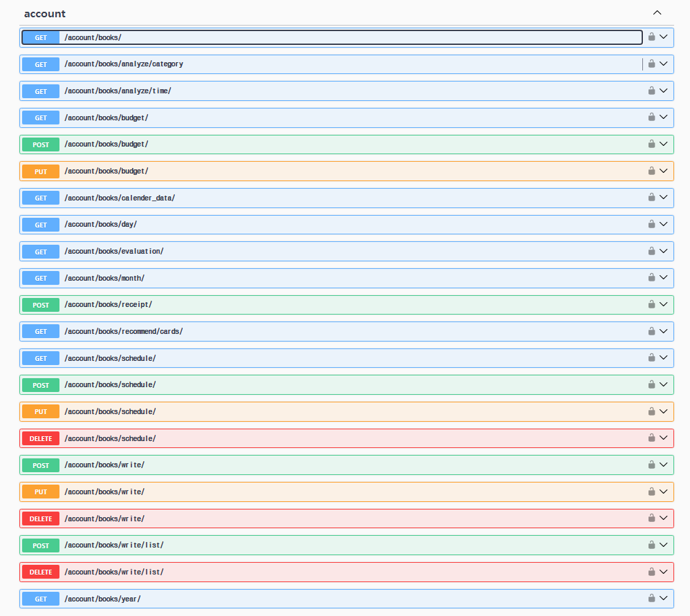
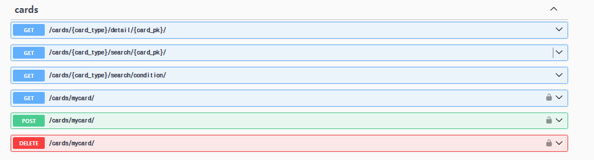

# 📅 가계북

  </img>

## ⏳ 프로젝트 진행과정 ##
> SSAFY 12기 1학기 관통 프로젝트 
> 개발기간: 2024.11.18 ~ 2024.11.27

## 🔥 가계북 개발 배경
현재에 가계부 서비스는 사용하기가 어렵다는 단점이 있습니다. 이에 저희 팀은 OCR 기술을 도입하여 사용자가 영수증만으로 손쉽게 소비내역을 등록하고 소비 내역을 바탕으로 카드를 추천 받을 수 있는 서비스를 개발하기 위해 이번 프로젝트를 기획하게 되었습니다. 

## 🔧 개발 환경 및 기술 스택 ##

### Frontend ###
 
 

### Backend ###

### 버전/이슈관리 ###

## 협업 ##

## ERD ##
  </img>

## REST API URL

### auth ###
</img>

### 가계부 ###
</img>

### 카드 ###
</img>

## 가계북 주요 기능 ##

### 🔔메인페이지 ###

### 📌카드 조회 ###

### 📅 캘린더 ###

### 📝 내역 ###

### 📸 영수증 인식 ###

### 📊 주간 월별 분석 ###

### 🔍 카테고리별 분석 ###

### 💳 내카드 목록 ###

### 💸 스마트한 카드 추천 ###

## 🤬 프로젝트 진행중 어려웠던 점

## 💡 개선하고 싶은 점

## 📝 소감 및 느낀 점

## :family: 팀원 소개 ##
<table align="center">
  <tr>
    <td>
<b>이지연
</td>
    <td>
<b>송동현
</td>
  </tr>
  <tr>
    <td></td>
    <td></td>
  </tr>
  <tr>
    <td>
프론트엔드
</td>
    <td>
백엔드
</td>
  </tr>
</table>