# 📅 가계북

  </img>

## ⏳ 프로젝트 진행과정 ##
> SSAFY 12기 1학기 관통 프로젝트 
> 개발기간: 2024.11.18 ~ 2024.11.27

## 🔥 가계북 개발 배경
현재에 가계부 서비스는 사용하기가 어렵다는 단점이 있습니다. 이에 저희 팀은 OCR 기술을 도입하여 사용자가 영수증만으로 손쉽게 소비내역을 등록하고 소비 내역을 바탕으로 카드를 추천 받을 수 있는 서비스를 개발하기 위해 이번 프로젝트를 기획하게 되었습니다. 

## 🔧 개발 환경 및 기술 스택 ##

### Frontend ###
 
 

### Backend ###

### 버전/이슈관리 ###

## 협업 ##

## ERD ##
  </img>

## REST API URL

### auth ###

  </img>

### 가계부 ###

  </img>

### 카드 ###

  </img>

## 가계북 주요 기능 ##

### 🔔메인페이지 ###

 

  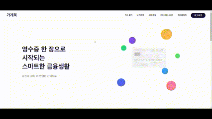</img>

### 📌카드 조회 ###

 

#### 카드 조회 ####

  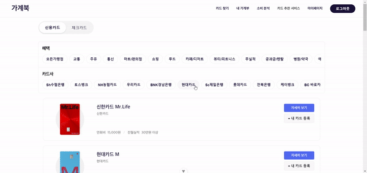</img>

> 카테고리별 필터링과 검색 기능을 통해 원하는 카드를 쉽게 찾을 수 있습니다. 각 카드의 주요 혜택과 기본 정보를 카드 리스트에서 바로 확인할 수 있습니다.

#### 카드 상세 페이지 ####

  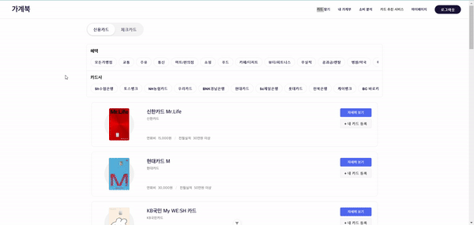</img>

> 선택한 카드의 상세 혜택, 연회비, 전월실적 등 자세한 정보를 제공합니다. 카드사 바로가기를 통해 즉시 카드 신청도 가능합니다.

### 📅 캘린더 ###

 

#### 달력 ####

  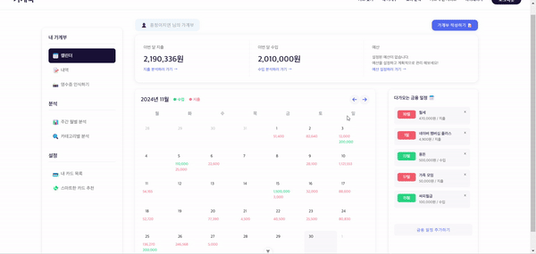</img>

> 월별 수입/지출 내역을 캘린더 형태로 시각화하여 제공합니다. 날짜별 거래 내역을 한눈에 파악할 수 있습니다.

#### 내역 ####

  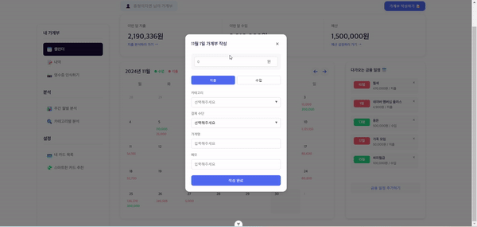</img>

> 거래 내역을 쉽게 추가하고 관리할 수 있습니다. 수입/지출, 카테고리, 금액, 메모 등 상세 정보를 기록할 수 있습니다.

#### 예산 ####

  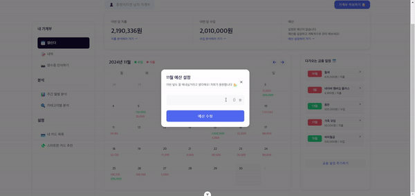</img>

> 월별 예산을 설정하고 관리할 수 있습니다. 설정된 예산 대비 실제 지출 현황을 추적할 수 있습니다.

#### 금융일정 ####

  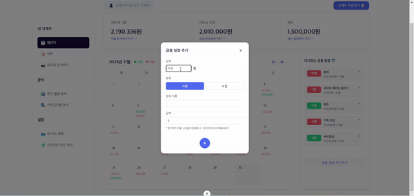</img>

> 정기적인 수입/지출 일정을 등록하고 관리할 수 있습니다. 월세, 공과금 등의 고정 지출을 자동으로 기록할 수 있습니다.

### 📝 내역 ###

 

#### 내역 조회 ####

  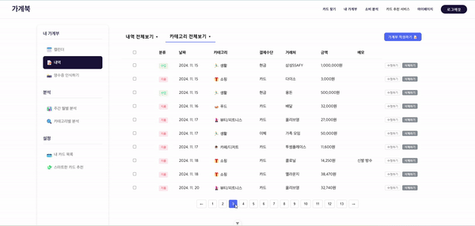</img>

> 전체 거래 내역을 리스트 형태로 확인할 수 있습니다. 카테고리별 필터링과 검색 기능을 제공합니다.

#### 내역 수정삭제 ####

  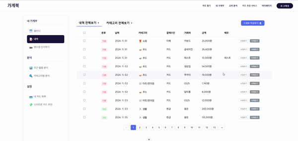</img>

> 등록된 거래 내역을 간편하게 수정하거나 삭제할 수 있습니다. 잘못 입력된 정보를 즉시 수정할 수 있습니다.

### 📸 영수증 인식 ###

  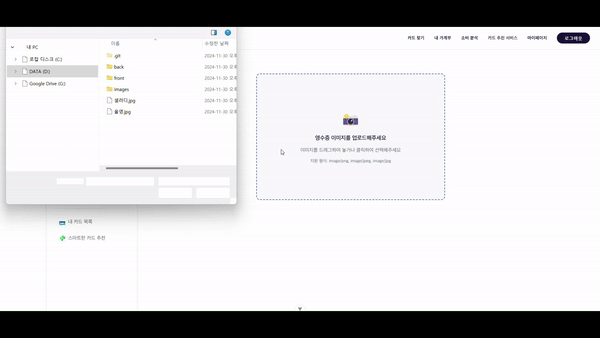</img>

> OCR 기술을 활용하여 영수증을 자동으로 인식하고 거래 내역을 등록할 수 있습니다. 수기, 전자, 종이영수증 모두 지원합니다.

### 📊 주간 월별 분석 ###

  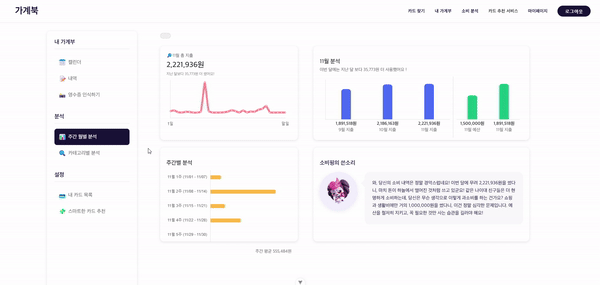</img>

> 기간별 소비 패턴을 다양한 차트로 분석하여 제공합니다. 지출 추이와 카테고리별 분석을 통해 효율적인 자금 관리가 가능합니다.

### 🔍 카테고리별 분석 ###

  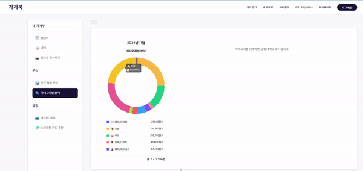</img>

> 카테고리별 지출 현황을 도넛 차트로 시각화하여 제공합니다. 각 카테고리별 상세 내역도 함께 확인할 수 있습니다.

### 💳 내카드 목록 ###

  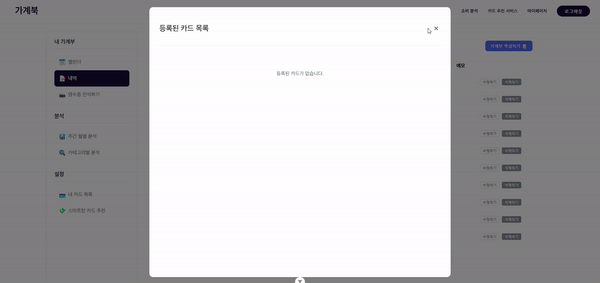</img>

> 사용중인 카드를 등록하고 관리할 수 있습니다. 등록된 카드의 혜택을 쉽게 확인하고 활용할 수 있습니다.

### 💸 스마트한 카드 추천 ###

  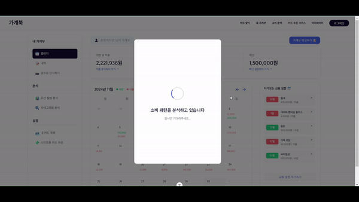</img>

> 사용자의 소비 패턴을 분석하여 최적의 카드를 추천해줍니다. 추천된 카드의 상세 정보를 바로 확인하고 신청할 수 있습니다.

## 🤬 프로젝트 진행중 어려웠던 점

## 💡 개선하고 싶은 점

## 📝 소감 및 느낀 점

## :family: 팀원 소개 ##
<table align="center">
  <tr>
    <td>
<b>이지연
</td>
    <td>
<b>송동현
</td>
  </tr>
  <tr>
    <td></td>
    <td></td>
  </tr>
  <tr>
    <td>
프론트엔드
</td>
    <td>
백엔드
</td>
  </tr>
</table>
